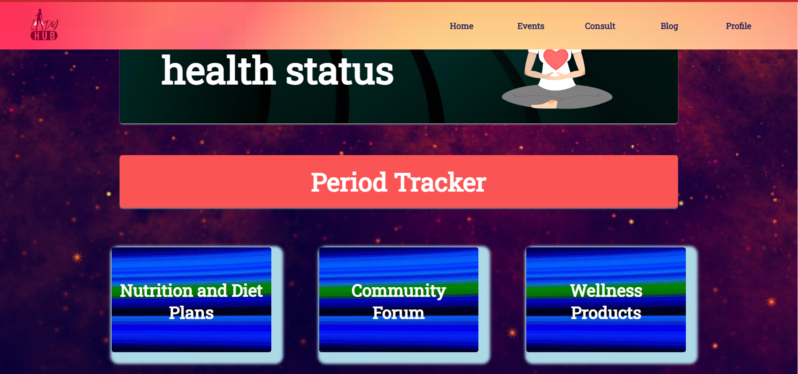
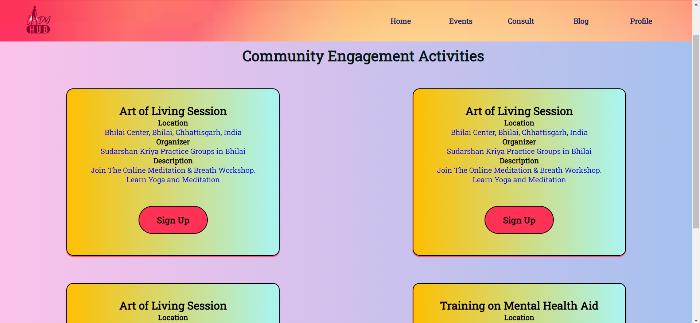
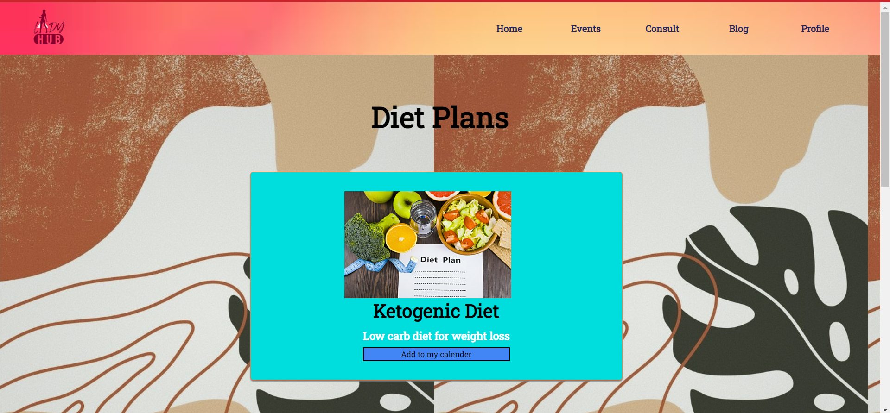

# LadyHub

A website aimed at spreading awareness and providing solution to issues related to mental and physical health and well being among women.

    
  </a>

## Overview

Our idea is to build a website which serves as a complete guide to a women's mental and physical health and well being. We aim at spreading awareness about health which is often neglected among women. Our website plans to constitute various features such as tracking of menstruation cycles, a quick general healthcare check up, mental health wellness and fitness blogs, a recreation or resources page, connect with doctors,Forum where women can discuss and share experiences etc.

## Features

* User Authentication
* General Health Diagnosis
* Mental Health Diagnosis
* Menstrual Cycle Tracker
* Diet Planner
* Calendar Alerts
* Blogs
* Health and Fitness Events
* Community Forum
* Expert Consultancy
* Video Chat with Experts
* Medical History
* Shop Health, Fitness and Wellness Products

## Technology Stack

### Web Technology

- Frontend
  - HTML
  - CSS
  - JavaScript
  
- Backend
  - PHP
  - MySQL (Database)

- Tools
  - Xampp
  - Git
  - Github

## Inspiration 💡
My idea is to build a website which serves as a complete guide to a women's mental and physical health and well-being. I aim to spread awareness about health which is often neglected among women.
## What it does ⚙️
 The website plans to constitute various features such as tracking menstruation cycles, a quick general healthcare check-up, mental health wellness and fitness blogs, a recreation or resources page, connect with doctors, and a forum where women can discuss and share experiences etc.
## How we built it ⚒️
For the front-end I used HTML, and CSS and for the backend, I used PHP and SQL. I made the database in MySql using PhpMyadmin and finally, hosted the website using 000webhost and used the MLH-provided GoDaddy registry domain. For the physical health checkup, I used ApiMedic API and for connecting with the Doctor using a live video conference, I used VideoWhisper.
## Challenges we ran into ❌
I had a major challenge in setting up the website properly for the physical health checkup section, wherein I had to use an API and make the front-end in such a way that all features could be implemented, but in the end, I figured everything out after hours of thinking, the errors I couldn't solve.
## Accomplishments that we're proud of 😊
How the final website turned out, I like how the site is as functional as I originally expected it to be. I am proud that I had fun in the process and I met other great hackers in the course of this hackathon, thanks to MLH for the opportunity.
## What we learned 👨‍🔬
Learned how to host a full-stack website using 000webhost, and also use a custom GoDaddy domain and host my website.
## What's next for Lady Hub ⏭️
Next up, I plan to launch a mobile app (iOS and android) for LadyHub). 
Detect the current mood of the user through questions and create Spotify playlists or movie
playlists.
To install a safety bell icon in our application so that in case a woman gets molested, she can send her
the exact location of the nearby Police Station.

## Screenshots

<!--  -->

### More power to women!
